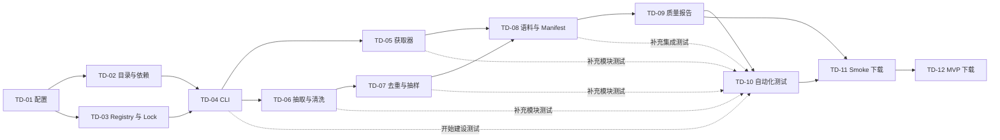

# task index: tokenizer dataset fetch script

## 来源

- todo：[tokenizer dataset fetch script](../../todo/tokenizer-dataset-fetch-script.md)
- plan：[tokenizer dataset fetch script](../../../plan/tokenizer-dataset-fetch-script.md)
- 本机硬件记录：[根目录 LOCAL_HARDWARE.md](../../../../LOCAL_HARDWARE.md)（本地合并记录，通过 `.git/info/exclude` 排除，不提交）

## 依赖图

实线表示完成依赖；虚线表示 TD-10 可以提前并行开始，但必须持续吸收对应模块的测试，直到 TD-09 完成后才能验收。

## 执行顺序

| 阶段 | 编号 | 子任务 | 最早开始条件 | 完成门槛 | 可并行任务 | 状态 |
| ---: | --- | --- | --- | --- | --- | --- |
| 1 | TD-01 | [冻结下载配置](td-01-freeze-download-config.md) | 无 | 无 | 无 | done |
| 2 | TD-02 | [建立目录与 Git 边界](td-02-data-layout-and-git-boundary.md) | TD-01 done | TD-01 | TD-03 | done |
| 2 | TD-03 | [建立数据源 registry](td-03-source-registry-and-lock.md) | TD-01 done | TD-01 | TD-02 | done |
| 3 | TD-04 | [实现 CLI 与 dry-run](td-04-cli-and-dry-run.md) | TD-02、TD-03 done | TD-02、TD-03 | 无 | done |
| 4 | TD-05 | [实现 HPLT 3.0 获取器](td-05-hplt-fetcher.md) | TD-04 done | TD-04 | TD-06、TD-10 | done |
| 4 | TD-06 | [实现文本抽取与保守清洗](td-06-text-extraction-and-cleaning.md) | TD-04 done | TD-04 | TD-05、TD-10 | done |
| 5 | TD-07 | [实现去重与均衡抽样](td-07-dedup-and-balanced-sampling.md) | TD-06 done | TD-06 | TD-05、TD-10 | done |
| 4/6 | TD-08 | [生成训练入口与 manifest](td-08-corpus-and-manifest.md) | TD-04 done 后可先设计 schema | TD-03、TD-05、TD-07 | TD-05、TD-06、TD-07、TD-10；仅限 schema 工作 | done |
| 7 | TD-09 | [生成质量报告](td-09-quality-report.md) | TD-08 done | TD-08 | TD-10 | done |
| 4-8 | TD-10 | [建立自动化测试](td-10-automated-tests.md) | TD-04 done | TD-05 至 TD-09 | TD-05 至 TD-09 | done |
| 9 | TD-11 | [执行 smoke 下载](td-11-smoke-download.md) | TD-09、TD-10 done | TD-09、TD-10 | 无 | done |
| 10 | TD-12 | [执行 MVP 下载](td-12-mvp-download.md) | TD-11 done | TD-11 | 无 | done |

## 并行窗口

1. 阶段 2：TD-02 与 TD-03 可以完全并行。TD-02 负责目录、Git 和依赖文件，TD-03 负责 registry 与 source lock，文件所有权不重叠。
2. 阶段 4：TD-05 与 TD-06 可以完全并行。两者必须共同遵守 TD-04 确定的接口；TD-05 负责获取和缓存，TD-06 负责纯文本抽取和清洗。
3. 阶段 4 至 8：TD-10 是持续并行任务。先建立 fixture 和测试框架，再随 TD-05 至 TD-09 的产物逐步补齐测试；它不能在 TD-09 之前标记 done。
4. 阶段 5：TD-06 完成后，TD-07 可以启动，即使 TD-05 尚未结束；TD-07 使用 fixture 和抽象文本流开发。
5. 阶段 4 至 6：TD-08 可以提前设计 manifest schema 和原子输出协议，但正式集成必须等待 TD-05 与 TD-07 完成。
6. 阶段 7：TD-09 与 TD-10 可以并行；TD-10 可先验证 TD-08，待 TD-09 产出后补齐报告测试并收口。
7. 阶段 9 至 10：TD-11 和 TD-12 涉及真实下载及验收，必须串行，不允许与未完成的实现任务并行。

## 关键路径

主关键路径为 `TD-01 -> (TD-02 + TD-03) -> TD-04 -> max(TD-05, TD-06 -> TD-07) -> TD-08 -> TD-09 -> TD-10 收口 -> TD-11 -> TD-12`。

其中 `+` 表示并行汇合，`max(...)` 表示 TD-08 必须等待两个分支都完成。若只安排一个执行者，应优先保证 `TD-06 -> TD-07` 分支连续推进，同时穿插 TD-05；若有多个执行者，可按并行窗口拆分文件所有权。

## 状态约定

- `pending`：尚未开始或依赖未完成。
- `in_progress`：正在执行。只有在上表允许并行、文件所有权明确且不会同时修改同一模块时，才允许多个任务同时处于该状态。
- `review`：实现完成，等待按 task 验收标准复核。
- `done`：验收通过，产物和验证记录齐全。

每个子任务完成后，应同时更新本索引和来源 todo 中对应复选框。实现、测试或运行结果必须记录在对应 task 文档中，不能只修改状态。并行任务在开始前应在各自 task 文档中记录负责文件，避免交叉修改。
