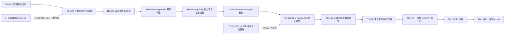

# task index: MVP model training

状态：active（human-parallel-first 近期语料重建；TD-02A in_progress）

## 来源

- plan：[MVP model training](../../plan/mvp-model-training.md)
- todo：[MVP model training](../../todo/mvp-model-training.md)
- 20 路范围修正：[中文简繁能力合同](../../../docs/chinese-locale-capability-contract.md)
- 冻结 tokenizer：[`mvp-tokenizer-v0`](../../../artifacts/tokenizers/mvp-tokenizer-v0/)
- tokenizer review：[mvp tokenizer review](../../done/review/mvp-tokenizer.md)
- CTranslate2 review：[CTranslate2 deployment review](../../done/review/ctranslate2-deployment.md)

## 当前关键路径

当前路径的核心变化是：先发布经语义审计的真实平行 corpus，再训练 human-first 60M 基线。Hy-MT2 不再承担默认 20 路补齐；DeepSeek 在 TD-04 只扫描大批句对并稀疏返回问题 ID，不自动翻译或改写数据。只有 human-first 基线完成并暴露具体弱路由后，才允许另立有界 synthetic 增强任务。

TD-02A～TD-05 还要把新来源的真人两侧按稳定 text/document identity 沉淀为未来 64k tokenizer 候选账本，但只登记最终 train-side 合格文本并排除 dev/test、holdout、synthetic、canary、quarantine 与路由重复。它复用本轮来源、许可和清洗投入，不代表 64k 训练集、配置或产物已经完成。

## 当前原子任务

| 顺序 | 编号 | 原子 task | 依赖 | 状态 |
| ---: | --- | --- | --- | --- |
| 1 | TD-02A | [建立近期平行语料来源与授权清单](td-02a-modern-corpus-inventory.md) | TD-01；历史失败结论 | in_progress |
| 2 | TD-02B | [运行小样本实收率与预算试验](td-02b-modern-corpus-pilot.md) | TD-02A | pending |
| 3 | TD-03 | [构建近期 human parallel 预审语料](td-03-modern-corpus-build.md) | TD-02B `proceed` | pending |
| 4 | TD-04 | [DeepSeek 长上下文批量审计](td-04-deepseek-batch-audit.md) | TD-02B、TD-03 | pending |
| 5 | TD-05 | [发布 human-first MVP 平行语料](td-05-modern-corpus-acceptance.md) | TD-03、TD-04 | pending |
| 6 | TD-16C | [训练 human-first 60M 候选](td-16c-repaired-human-foundation.md) | 新 TD-05、TD-16A | pending / 待重写执行合同 |
| 7 | TD-16D | [执行或跳过一次弱路由补强](td-16d-human-led-distillation.md) | TD-16C | pending / 待按实际弱路由重写 |
| 8 | TD-16E | [验证重复能力等价并冻结候选](td-16e-capability-equivalence-selection.md) | TD-16D | pending |
| 9 | TD-16F | [执行一次性正式 test 并发布 MVP](td-16f-formal-test-release.md) | TD-16E | pending |
| 10 | TD-17 | [完成 CTranslate2 回接与量化诊断](td-17-ctranslate2-deployment.md) | TD-16F | pending |
| 11 | TD-18 | [完成统一回归、文档与 review](td-18-regression-and-review.md) | TD-01～TD-17 | pending |

TD-16C/TD-16D 现在只冻结方向，不立即修改训练配方：它们必须等待 TD-05 报告真实 groups、tokens、路线和长度分布后再配置，避免再次先写训练预算、后找数据填满。

## 已完成基础设施

| 编号 | 内容 | 状态与当前用途 |
| --- | --- | --- |
| TD-01 | 数据/训练/路径边界 | completed，继续生效 |
| TD-06 | Hy-MT2 运行时与量化对比 | completed，仅作历史 teacher 诊断/可选未来实验 |
| TD-07～TD-08 | 旧 prompt/decode、D0/D1 | completed，冻结历史证据，不自动进入新 corpus |
| TD-09 | tokenizer 编码、collator、student 构造 | completed，待用新 TD-05 fixture 重验 |
| TD-10～TD-11 | 高吞吐训练循环、checkpoint/resume | completed，可复用 |
| TD-12 | M1 小样本过拟合 | completed，只证明训练器可学习 |
| TD-13 | 20 路独立评测 | completed，协议继续使用 |
| TD-14 | 旧资源 profile/soak | completed，正式新语料长度分布上需重新基准 |
| TD-15 | 旧 human/Hy-MT2 等预算 A/B | completed，诊断为 human 胜出，不是新训练配方 |
| TD-16A | 硬件可配置高吞吐训练器 | completed，可复用 |
| TD-16B | 旧 MASSIVE M0 长训 | completed/rejected，checkpoint 不准入 |

## 不可变历史数据链

- [旧 TD-02 schema v4 来源与 lock](td-02-dataset-research-and-lock.md)；
- [旧 TD-03 ability-first source bank](td-03-data-pipeline.md)；
- [旧 TD-04 Hy-MT2 v1/v2/v3 生成与拒绝](td-04-ability-first-teacher-generation.md)；
- [旧 TD-05 mixed corpus（blocked）](td-05-ability-first-mixed-corpus.md)；
- 旧 [M0 split/去重](td-04-split-dedup-leakage.md) 与 [M0 验收](td-05-m0-dataset-acceptance.md)。

这些文件继续解释历史 artifact，不能被修改为“其实已经完成新 corpus”。新任务使用新 config/lock/runtime identity 和新运行根。

## 资源与并行边界

1. TD-02A 是只读研究，可与不改相同文档/配置的代码诊断并行；TD-02B 必须等待来源清单。
2. TD-03 负责下载、规范化和硬门；TD-04 才调用远程 API，两者不能同时改写同一 preaudit/audit 运行根。
3. DeepSeek 请求按同路线/来源/领域组成长上下文，输出只列问题 ID。批次必须受 token 与费用预算限制；更大上下文是否更省钱由 canary 召回和未标记抽检决定。
4. TD-05 完成前不启动 student 长训，不执行 synthetic fill，不运行正式 test。
5. 正式 test 只允许 TD-16F 对 TD-16E 唯一候选消费一次。

## 原子 task 约定

- 每个当前 task 文件是一个不可拆分验收单元；task group TD-02 只有 TD-02A/TD-02B 全部完成后才可完成。
- `completed` 表示产物可供下游消费，不代表整个 todo 已通过统一 review。
- 开始 task 时记录负责文件、运行根、预算和验证命令；完成时同步更新本索引、todo 和 task 证据。
- 现有工作区可能包含其他未提交实验；只提交与当前 task 明确相关的文件，不吸收无关改动。

## 状态约定

- `pending`：依赖未满足或尚未开始。
- `in_progress`：依赖满足并正在执行。
- `blocked`：验收失败且必须回到明确上游，不得靠降低门槛继续。
- `suspended`：后置任务曾执行，但当前上游身份已失效。
- `completed`：实现、产物和证据齐全，可供下游消费。
- `review` / `done`：仅用于完整 todo 的统一复核与归档。
