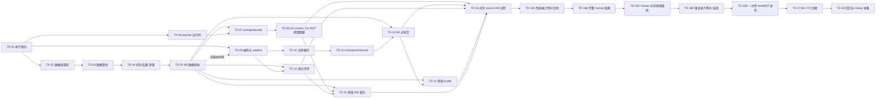

# task index: MVP model training

状态：active（TD-01～TD-15 completed；TD-16 A/B 诊断已完成，TD-16A～TD-16E pending）

## 来源

- plan：[MVP model training](../../plan/mvp-model-training.md)
- todo：[MVP model training](../../todo/mvp-model-training.md)
- 20 路范围修正：[中文简繁能力合同](../../../docs/chinese-locale-capability-contract.md)
- 冻结 tokenizer：[`mvp-tokenizer-v0`](../../../artifacts/tokenizers/mvp-tokenizer-v0/)
- tokenizer review：[mvp tokenizer review](../../done/review/mvp-tokenizer.md)
- CTranslate2 review：[CTranslate2 deployment review](../../done/review/ctranslate2-deployment.md)

## 依赖图

虚线表示 TD-09 可先用 TD-01 schema fixture 开发，但其完整验收必须等待 TD-05 的冻结 fixture/manifest。其余实线均为完成依赖。

## 执行顺序

| 阶段 | 编号 | 原子 task | 最早开始条件 | 完成门槛 | 可并行任务 | 状态 |
| ---: | --- | --- | --- | --- | --- | --- |
| 1 | TD-01 | [冻结执行契约、目录与 Git 边界](td-01-execution-contract.md) | 无 | 无 | TD-02 | completed |
| 2 | TD-02 | [调研并锁定有界平行数据来源](td-02-dataset-research-and-lock.md) | TD-01 completed | TD-01 | 无 | completed |
| 3 | TD-03 | [实现确定性平行数据构建管线](td-03-data-pipeline.md) | TD-01、TD-02 completed | TD-01、TD-02 | 无 | completed |
| 4 | TD-04 | [实现分组切分、去重与泄漏防护](td-04-split-dedup-leakage.md) | TD-03 completed | TD-03 | 无 | completed |
| 5 | TD-05 | [构建并验收 M0 数据集](td-05-m0-dataset-acceptance.md) | TD-04 completed | TD-04 | 无 | completed |
| 2–5 | TD-06 | [锁定并验证 Hy-MT2 7B teacher 运行时](td-06-hymt2-teacher-runtime.md) | TD-01 completed | TD-01 | TD-02～TD-05、TD-09～TD-11 | completed |
| 6 | TD-07 | [校准 teacher 语言映射、prompt 与解码](td-07-teacher-prompt-decode.md) | TD-05、TD-06 completed | TD-05、TD-06 | 无 | completed |
| 7 | TD-08 | [生成 D0 smoke 并验收 D1 最小可用蒸馏数据](td-08-distilled-data.md) | TD-07 completed | TD-05、TD-07 | 无 | completed |
| 2–5 | TD-09 | [实现编码、collator 与 student 构造](td-09-student-encoding-builder.md) | TD-01 completed | TD-01；完整验收等待 TD-05 | TD-02～TD-06 | completed |
| 3–5 | TD-10 | [实现训练循环、采样与运行记录](td-10-training-loop.md) | TD-09 completed | TD-09 | TD-03～TD-06 | completed |
| 4–5 | TD-11 | [实现原子 checkpoint 与精确恢复](td-11-checkpoint-resume.md) | TD-10 completed | TD-10 | TD-04～TD-06 | completed |
| 6 | TD-12 | [完成 M1 小样本过拟合与恢复验收](td-12-m1-overfit-resume.md) | TD-05、TD-11 completed | TD-05、TD-11 | TD-07、TD-13 | completed |
| 6 | TD-13 | [实现独立评测与方向汇总](td-13-evaluation.md) | TD-05、TD-09 completed | TD-05、TD-09 | TD-07、TD-12 | completed |
| 7 | TD-14 | [基准测试并冻结可配置训练资源 profile](td-14-training-resource-profile.md) | TD-05、TD-12 completed | TD-05、TD-12 | TD-08、TD-13 | completed |
| 8 | TD-15 | [冻结蒸馏配方与等预算 A/B 契约](td-15-distillation-ab-contract.md) | TD-05、TD-08、TD-13 completed | TD-05、TD-08、TD-13 | TD-14 | completed |
| 9.0 | TD-16 | [训练并冻结基于现有语料能力的 MVP 模型（任务组）](td-16-m2-training.md) | TD-05、TD-08、TD-12～TD-15 completed | TD-05、TD-08、TD-12～TD-15 | 无 | in_progress |
| 9.1 | TD-16A | [定版性能优先训练器与能力等价合同](td-16a-performance-equivalence-contract.md) | TD-16 A/B 诊断完成 | TD-16 | 无 | pending |
| 9.2 | TD-16B | [训练完整 human M0 底模](td-16b-full-human-foundation.md) | TD-16A completed | TD-16A | 无 | pending |
| 9.3 | TD-16C | [执行 human 主导的蒸馏辅助训练](td-16c-human-led-distillation.md) | TD-16B completed | TD-16B | 无 | pending |
| 9.4 | TD-16D | [验证重复训练能力等价并冻结唯一候选](td-16d-capability-equivalence-selection.md) | TD-16C completed | TD-16C | 无 | pending |
| 9.5 | TD-16E | [执行一次性正式 test 并发布 MVP](td-16e-formal-test-release.md) | TD-16D completed | TD-16D | 无 | pending |
| 10 | TD-17 | [完成 M3 CTranslate2 回接与量化诊断](td-17-ctranslate2-deployment.md) | TD-16E completed | TD-16E | 无 | pending |
| 11 | TD-18 | [完成统一回归、文档与 review 准备](td-18-regression-and-review.md) | TD-01～TD-17 completed | TD-01～TD-17 | 无 | pending |

## 并行窗口与资源互斥

1. TD-01 完成后，人类数据链 TD-02～TD-05、teacher 运行时 TD-06、student 基础链 TD-09～TD-11 可并行推进，前提是负责文件和运行目录不重叠。
2. TD-09 已使用正式 20 路 fixture 完成编码、student 构造、CPU forward/backward 和离线重载；TD-10 从该冻结接口继续。
3. TD-05 与 TD-06 已汇合；TD-07 的新增两路校准和 TD-08 的两路 addendum/20 路 composite 均已完成。D0/D1 v1 保持不可变。
4. TD-12、TD-13 可并行；TD-14 必须等待 TD-12。TD-15 可与 TD-14 并行准备；已完成的 TD-16 共同 source A/B 诊断依赖两者。
5. 若运行时探测只有一个可用 accelerator，TD-06～TD-08 的 teacher 运行、TD-14 的 student 基准和 TD-16A～TD-16E 的训练/评测在执行层面互斥；资源互斥依据探测结果和 profile，不依据 GPU 型号。
6. TD-16A、TD-16B、TD-16C、TD-16D、TD-16E、TD-17、TD-18 为严格串行收口；正式 test 只允许 TD-16E 对 TD-16D 唯一候选读取一次。

## 关键路径

当前已完成 `TD-01 -> ... -> TD-15` 以及原 TD-16 的 44,313 条共同 source、1,000-step human-only/distilled A/B 诊断。该诊断选择 human-only step 1,000，但没有训练完整 226,218 条 human M0，也没有执行 human-led mixed 训练、重复能力等价验收或正式 test，因此不是最终 MVP。关键路径现从 TD-16A 继续，直至 TD-16E 才完成 TD-16 任务组。

任何来源/许可缺口、teacher 离线运行失败、M1 未过拟合、恢复不一致或 test 隔离失败都会阻塞后续汇合，不得以跳过 task 的方式继续。

## 原子 task 约定

- 除 `td-16-m2-training.md` 明确作为任务组索引外，每个 task 文件是一个不可拆分的验收单元；TD-16 只有在 TD-16A～TD-16E 全部完成后才能从 `in_progress` 标为 `completed`。
- `completed` 只表示可供后续 task 消费，尚未进入统一 review；不得为单个 task 创建独立 review。
- task 开始时在对应文件记录负责文件、运行目录和验证命令；并行 task 不得同时修改同一文件或写入同一 artifact/staging 目录。
- task 完成时同步更新本索引状态、来源 todo 的对应复选框，并在 task 文件追加实现/运行证据；不能只改状态。
- TD-01～TD-15、TD-16A～TD-16E、TD-17～TD-18 全部 completed 后才进入 todo 级统一 review；通过后 plan/todo/task/review 一并归档并标记 `done`。

## 状态约定

- `pending`：尚未开始或完成依赖未满足。
- `in_progress`：依赖满足，已记录执行边界并正在实施。
- `completed`：本 task 的实现、产物和验收证据齐全，可供后续 task 使用。
- `review`：仅用于 TD-18 完成后的整个 todo 统一复核。
- `done`：统一 review 通过且整个工作流已归档。
