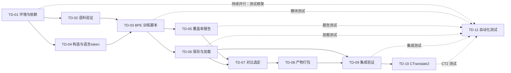

# task index: mvp tokenizer

## 来源

- todo：[mvp tokenizer](../../todo/mvp-tokenizer.md)
- plan：[mvp tokenizer](../../../plan/mvp-tokenizer.md)
- 本机硬件记录：[local-hardware.md](local-hardware.md)（通过 `.git/info/exclude` 排除，不提交）

## 依赖图

实线表示完成依赖；虚线表示 TD-11 可以提前并行开始，但必须持续吸收对应模块的测试，直到 TD-10 完成后才能验收。

## 执行顺序

| 阶段 | 编号 | 子任务 | 最早开始条件 | 完成门槛 | 可并行任务 | 状态 |
| ---: | --- | --- | --- | --- | --- | --- |
| 1 | TD-01 | [训练环境与依赖](td-01-environment-and-deps.md) | 无 | 无 | TD-02 | done |
| 1 | TD-02 | [语料输入验证](td-02-corpus-validation.md) | 无 | 无 | TD-01 | done |
| 2 | TD-04 | [NllbTokenizer 构造与语言 token 映射](td-04-tokenizer-construction.md) | TD-01 done | TD-01 | 无 | done |
| 3 | TD-03 | [NLLB BPE 训练脚本](td-03-training-script.md) | TD-01、TD-02、TD-04 done | TD-01、TD-02、TD-04 | 无 | done |
| 4 | TD-05 | [覆盖率与编码质量报告](td-05-coverage-reports.md) | TD-03 done | TD-03 | TD-06、TD-11 | in_progress |
| 4 | TD-06 | [产物保存与 AutoTokenizer 加载验证](td-06-save-and-load.md) | TD-03 done | TD-03、TD-04 | TD-05、TD-11 | pending |
| 5 | TD-07 | [32k vs 48k 对比与 MVP 默认选定](td-07-comparison-and-selection.md) | TD-05、TD-06 done | TD-05、TD-06 | 无 | pending |
| 6 | TD-08 | [产物打包与文档](td-08-packaging.md) | TD-07 done | TD-07 | TD-11 | pending |
| 7 | TD-09 | [最小训练链路集成验证](td-09-integration-test.md) | TD-06、TD-08 done | TD-06、TD-08 | TD-11 | pending |
| 8 | TD-10 | [CTranslate2 转换与 CPU 推理冒烟](td-10-ctranslate2-smoke.md) | TD-09 done | TD-09 | TD-11 | pending |
| 3–8 | TD-11 | [自动化测试](td-11-automated-tests.md) | TD-01 done 后可建框架 | TD-03 至 TD-10 | TD-03 至 TD-10 | pending |

## 并行窗口

1. 阶段 1：TD-01 与 TD-02 可以完全并行。TD-01 负责依赖锁定和环境验证，TD-02 负责语料文件验收，文件所有权不重叠。
2. 阶段 4：TD-05 与 TD-06 可以完全并行。TD-05 用训练好的 tokenizer 跑评测，TD-06 验证保存/加载行为，两者只需读 tokenizer 产物。
3. 阶段 3 至 8：TD-11 是持续并行任务。先建立 fixture 和测试框架（TD-01 完成后即可开始），再随 TD-03 至 TD-10 的产物逐步补齐测试；它不能在 TD-10 之前标记 done。
4. 阶段 7 至 8：TD-09 和 TD-10 涉及本地 HF checkpoint 和 CTranslate2 转换，必须串行。TD-10 的 CT2 转换器需要 TD-09 产出的完整 HF checkpoint 目录。

## 关键路径

主关键路径为 `TD-01 -> TD-04 -> TD-03 -> TD-05/TD-06 -> TD-07 -> TD-08 -> TD-09 -> TD-10`，TD-11 持续并行并在 TD-10 后收口。

其中 `TD-05/TD-06` 表示并行汇合，TD-07 必须等待两分支都完成。若只安排一个执行者，应优先推进 `TD-03 -> TD-05/TD-06 -> TD-07` 主线，同时穿插 TD-11 测试框架；若有多个执行者，可按并行窗口拆分。

## 状态约定

- `pending`：尚未开始或依赖未完成。
- `in_progress`：正在执行。只有在上表允许并行、文件所有权明确且不会同时修改同一模块时，才允许多个任务同时处于该状态。
- `review`：实现完成，等待按 task 验收标准复核。
- `done`：验收通过，产物和验证记录齐全。

每个子任务完成后，应同时更新本索引和来源 todo 中对应复选框。实现、测试或运行结果必须记录在对应 task 文档中，不能只修改状态。并行任务在开始前应在各自 task 文档中记录负责文件，避免交叉修改。
